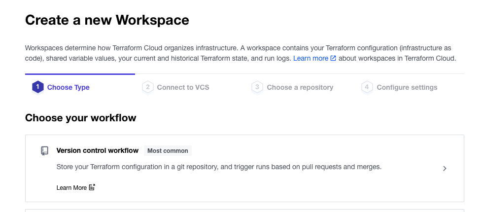
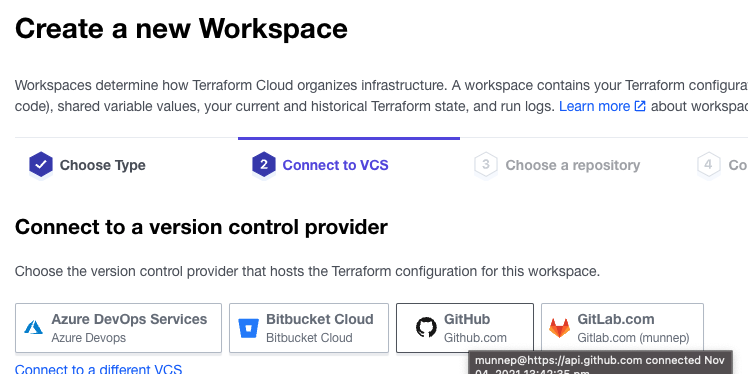
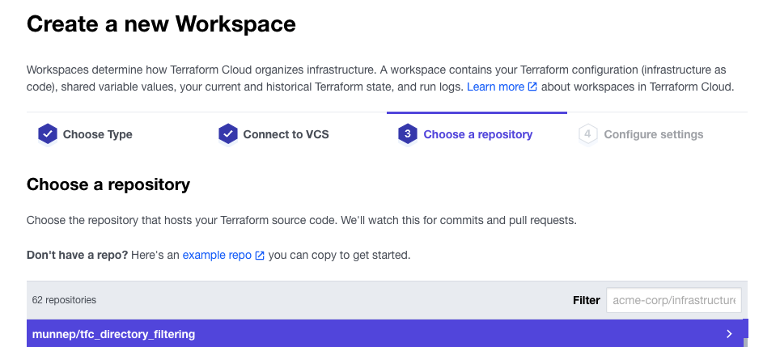
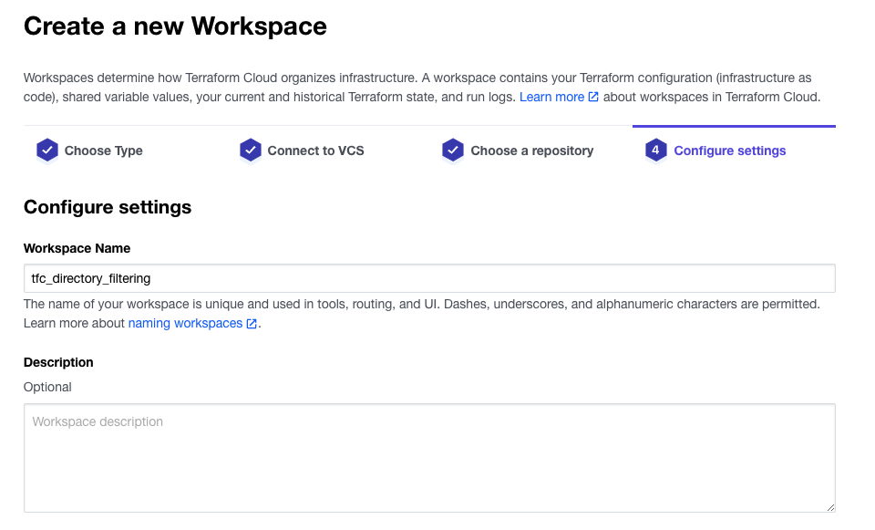
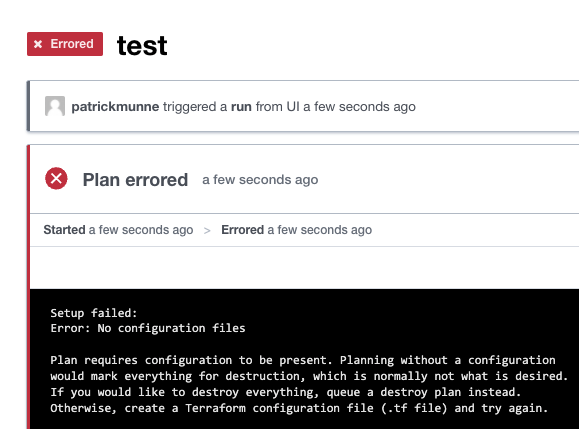
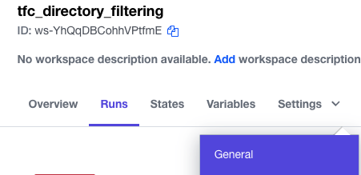
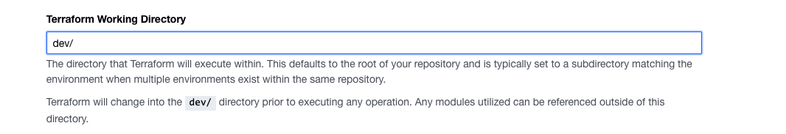
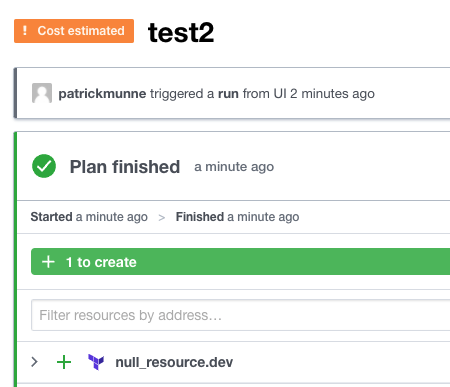

# tfc_directory_filtering
TFC directory filtering

# Example: null provider and directory filtering with TFC

Directory filtering enables you to define on which directory in your repository terraform will execute [See documentation](https://www.terraform.io/cloud-docs/workspaces/settings#terraform-working-directory) 

# How to

- Clone/Fork this repository to your own VCS
- Within TFC make a new workspace that points to this repository  
  
  
  
  
- When running a new plan you will get no output. No configuration.   
  
- change the directory where it should execute from. Go to settings --> General --> Terraform Working Directory
  
- Change the value to dev/
  
- save settings
- Create a new run and you should see a null_resource.dev wanting to be created
  